# Village Banking Web Application
# Database Schema and ERD Design

## 1. Design Position

This schema is designed for PostgreSQL and follows a ledger-first financial model.

The core idea is:

- cycle rules are stored per cycle,
- declarations capture member intent,
- ledger transactions capture actual financial postings,
- monthly processing creates controlled snapshots,
- locked months prevent ordinary edits,
- reversals and overrides preserve audit history.

Balances should be derived from ledger entries or from monthly snapshots generated from ledger entries. Financial balances should not be silently edited.

## 2. Recommended PostgreSQL Extensions

```sql
CREATE EXTENSION IF NOT EXISTS pgcrypto;
```

UUID primary keys are recommended for public-facing application identifiers.

## 3. Enum Types

```sql
CREATE TYPE user_role AS ENUM (
  'ADMIN',
  'MEMBER',
  'AUDITOR'
);

CREATE TYPE cycle_status AS ENUM (
  'DRAFT',
  'ACTIVE',
  'CLOSED',
  'ARCHIVED'
);

CREATE TYPE cycle_member_status AS ENUM (
  'ACTIVE',
  'INACTIVE',
  'REMOVED'
);

CREATE TYPE cycle_month_status AS ENUM (
  'OPEN',
  'DECLARATION_PERIOD',
  'PAYOUT_PERIOD',
  'PROCESSING',
  'REVIEW',
  'LOCKED',
  'REOPENED'
);

CREATE TYPE declaration_status AS ENUM (
  'DRAFT',
  'SUBMITTED',
  'LATE',
  'MISSED',
  'CANCELLED'
);

CREATE TYPE approval_status AS ENUM (
  'PENDING',
  'APPROVED',
  'REJECTED',
  'CANCELLED'
);

CREATE TYPE borrowing_compliance_status AS ENUM (
  'NEVER_BORROWED',
  'BORROWED_BELOW_MINIMUM',
  'AT_OR_ABOVE_MINIMUM'
);

CREATE TYPE ledger_transaction_type AS ENUM (
  'SAVINGS_DEPOSIT',
  'SAVINGS_INTEREST',
  'SOCIAL_FUND_PAYMENT',
  'MEMBERSHIP_FEE_PAYMENT',
  'LOAN_DISBURSEMENT',
  'LOAN_TOP_UP',
  'PRINCIPAL_REPAYMENT',
  'LOAN_INTEREST_ASSESSMENT',
  'LOAN_INTEREST_REPAYMENT',
  'COMMON_INTEREST_ASSESSMENT',
  'COMMON_INTEREST_PAYMENT',
  'PENALTY_ASSESSMENT',
  'PENALTY_PAYMENT',
  'CONVERTED_PENALTY_LOAN',
  'ADMIN_ADJUSTMENT',
  'REVERSAL'
);

CREATE TYPE ledger_account_type AS ENUM (
  'SAVINGS_PRINCIPAL',
  'SAVINGS_INTEREST',
  'SOCIAL_FUND',
  'MEMBERSHIP_FEE',
  'LOAN_PRINCIPAL',
  'LOAN_INTEREST',
  'COMMON_INTEREST',
  'PENALTY',
  'CASH_POOL',
  'ADJUSTMENT'
);

CREATE TYPE loan_origin_type AS ENUM (
  'ORIGINAL_LOAN',
  'TOP_UP',
  'CONVERTED_PENALTY',
  'ADMIN_CONVERSION'
);

CREATE TYPE penalty_status AS ENUM (
  'ASSESSED',
  'PAID',
  'PARTIALLY_PAID',
  'CONVERTED_TO_LOAN',
  'WAIVED',
  'REVERSED'
);

CREATE TYPE common_interest_allocation_method AS ENUM (
  'ONLY_NON_BORROWERS_EQUAL',
  'NON_BORROWERS_AND_BELOW_MINIMUM_PROPORTIONAL',
  'ALL_MEMBERS_EQUAL',
  'MANUAL_OVERRIDE'
);

CREATE TYPE contribution_type AS ENUM (
  'SOCIAL_FUND',
  'MEMBERSHIP_FEE'
);

CREATE TYPE audit_action AS ENUM (
  'CREATE',
  'UPDATE',
  'DELETE',
  'APPROVE',
  'REJECT',
  'POST',
  'REVERSE',
  'OVERRIDE',
  'LOCK',
  'REOPEN',
  'LOGIN'
);
```

## 4. Core Identity and Access Tables

### users

Application login accounts.

```sql
CREATE TABLE users (
  id UUID PRIMARY KEY DEFAULT gen_random_uuid(),
  email TEXT NOT NULL UNIQUE,
  password_hash TEXT NOT NULL,
  role user_role NOT NULL,
  is_active BOOLEAN NOT NULL DEFAULT TRUE,
  last_login_at TIMESTAMPTZ,
  created_at TIMESTAMPTZ NOT NULL DEFAULT now(),
  updated_at TIMESTAMPTZ NOT NULL DEFAULT now()
);
```

### members

Member profile independent of any cycle.

```sql
CREATE TABLE members (
  id UUID PRIMARY KEY DEFAULT gen_random_uuid(),
  user_id UUID UNIQUE REFERENCES users(id),
  member_code TEXT UNIQUE,
  first_name TEXT NOT NULL,
  last_name TEXT NOT NULL,
  phone TEXT,
  national_id TEXT,
  address TEXT,
  is_active BOOLEAN NOT NULL DEFAULT TRUE,
  created_at TIMESTAMPTZ NOT NULL DEFAULT now(),
  updated_at TIMESTAMPTZ NOT NULL DEFAULT now()
);
```

## 5. Cycle Configuration Tables

### cycles

Stores one banking cycle and its financial rules.

```sql
CREATE TABLE cycles (
  id UUID PRIMARY KEY DEFAULT gen_random_uuid(),
  name TEXT NOT NULL,
  description TEXT,
  start_date DATE NOT NULL,
  end_date DATE NOT NULL,
  status cycle_status NOT NULL DEFAULT 'DRAFT',

  savings_cap NUMERIC(14,2) NOT NULL,
  minimum_borrowing_amount NUMERIC(14,2) NOT NULL,
  savings_interest_rate NUMERIC(8,6) NOT NULL,
  loan_interest_rate NUMERIC(8,6) NOT NULL,
  common_interest_rate NUMERIC(8,6) NOT NULL,

  social_fund_amount NUMERIC(14,2) NOT NULL DEFAULT 0,
  membership_fee_amount NUMERIC(14,2) NOT NULL DEFAULT 0,

  declaration_start_day SMALLINT NOT NULL,
  declaration_end_day SMALLINT NOT NULL,
  payout_start_day SMALLINT NOT NULL,
  payout_end_day SMALLINT NOT NULL,

  rounding_scale SMALLINT NOT NULL DEFAULT 2,
  rounding_mode TEXT NOT NULL DEFAULT 'HALF_UP',

  created_by UUID REFERENCES users(id),
  created_at TIMESTAMPTZ NOT NULL DEFAULT now(),
  updated_at TIMESTAMPTZ NOT NULL DEFAULT now(),

  CONSTRAINT cycles_date_check CHECK (end_date >= start_date),
  CONSTRAINT cycles_rates_check CHECK (
    savings_interest_rate >= 0
    AND loan_interest_rate >= 0
    AND common_interest_rate >= 0
  ),
  CONSTRAINT cycles_amounts_check CHECK (
    savings_cap >= 0
    AND minimum_borrowing_amount >= 0
    AND social_fund_amount >= 0
    AND membership_fee_amount >= 0
  )
);
```

### cycle_months

One row per operational month in a cycle.

```sql
CREATE TABLE cycle_months (
  id UUID PRIMARY KEY DEFAULT gen_random_uuid(),
  cycle_id UUID NOT NULL REFERENCES cycles(id),
  month_number INTEGER NOT NULL,
  period_start DATE NOT NULL,
  period_end DATE NOT NULL,
  declaration_window_start DATE NOT NULL,
  declaration_window_end DATE NOT NULL,
  payout_window_start DATE NOT NULL,
  payout_window_end DATE NOT NULL,
  status cycle_month_status NOT NULL DEFAULT 'OPEN',
  locked_at TIMESTAMPTZ,
  locked_by UUID REFERENCES users(id),
  created_at TIMESTAMPTZ NOT NULL DEFAULT now(),
  updated_at TIMESTAMPTZ NOT NULL DEFAULT now(),

  UNIQUE (cycle_id, month_number),
  CONSTRAINT cycle_months_date_check CHECK (period_end >= period_start)
);
```

### cycle_members

Member enrollment into a cycle.

```sql
CREATE TABLE cycle_members (
  id UUID PRIMARY KEY DEFAULT gen_random_uuid(),
  cycle_id UUID NOT NULL REFERENCES cycles(id),
  member_id UUID NOT NULL REFERENCES members(id),
  status cycle_member_status NOT NULL DEFAULT 'ACTIVE',
  joined_at DATE NOT NULL,
  left_at DATE,
  created_at TIMESTAMPTZ NOT NULL DEFAULT now(),
  updated_at TIMESTAMPTZ NOT NULL DEFAULT now(),

  UNIQUE (cycle_id, member_id)
);
```

### penalty_types

Configurable penalty definitions per cycle.

```sql
CREATE TABLE penalty_types (
  id UUID PRIMARY KEY DEFAULT gen_random_uuid(),
  cycle_id UUID NOT NULL REFERENCES cycles(id),
  code TEXT NOT NULL,
  name TEXT NOT NULL,
  description TEXT,
  amount NUMERIC(14,2) NOT NULL,
  is_convertible_to_loan BOOLEAN NOT NULL DEFAULT TRUE,
  is_active BOOLEAN NOT NULL DEFAULT TRUE,
  created_at TIMESTAMPTZ NOT NULL DEFAULT now(),

  UNIQUE (cycle_id, code),
  CONSTRAINT penalty_types_amount_check CHECK (amount >= 0)
);
```

## 6. Declaration and Operational Input Tables

### declarations

Monthly declaration submitted by a member or admin.

```sql
CREATE TABLE declarations (
  id UUID PRIMARY KEY DEFAULT gen_random_uuid(),
  cycle_id UUID NOT NULL REFERENCES cycles(id),
  cycle_month_id UUID NOT NULL REFERENCES cycle_months(id),
  cycle_member_id UUID NOT NULL REFERENCES cycle_members(id),

  savings_amount NUMERIC(14,2) NOT NULL DEFAULT 0,
  loan_request_amount NUMERIC(14,2) NOT NULL DEFAULT 0,
  loan_top_up_amount NUMERIC(14,2) NOT NULL DEFAULT 0,
  principal_repayment_amount NUMERIC(14,2) NOT NULL DEFAULT 0,
  loan_interest_repayment_amount NUMERIC(14,2) NOT NULL DEFAULT 0,
  common_interest_payment_amount NUMERIC(14,2) NOT NULL DEFAULT 0,
  other_obligation_amount NUMERIC(14,2) NOT NULL DEFAULT 0,

  status declaration_status NOT NULL DEFAULT 'SUBMITTED',
  submitted_at TIMESTAMPTZ NOT NULL DEFAULT now(),
  submitted_by UUID REFERENCES users(id),
  is_within_window BOOLEAN NOT NULL,
  notes TEXT,
  created_at TIMESTAMPTZ NOT NULL DEFAULT now(),
  updated_at TIMESTAMPTZ NOT NULL DEFAULT now(),

  UNIQUE (cycle_month_id, cycle_member_id),
  CONSTRAINT declarations_amounts_check CHECK (
    savings_amount >= 0
    AND loan_request_amount >= 0
    AND loan_top_up_amount >= 0
    AND principal_repayment_amount >= 0
    AND loan_interest_repayment_amount >= 0
    AND common_interest_payment_amount >= 0
    AND other_obligation_amount >= 0
  )
);
```

### contribution_payments

One-time social fund and membership fee payments.

```sql
CREATE TABLE contribution_payments (
  id UUID PRIMARY KEY DEFAULT gen_random_uuid(),
  cycle_id UUID NOT NULL REFERENCES cycles(id),
  cycle_member_id UUID NOT NULL REFERENCES cycle_members(id),
  contribution_type contribution_type NOT NULL,
  amount NUMERIC(14,2) NOT NULL,
  paid_at TIMESTAMPTZ NOT NULL DEFAULT now(),
  ledger_transaction_id UUID,
  posted_by UUID REFERENCES users(id),
  notes TEXT,
  created_at TIMESTAMPTZ NOT NULL DEFAULT now(),

  UNIQUE (cycle_id, cycle_member_id, contribution_type),
  CONSTRAINT contribution_payments_amount_check CHECK (amount >= 0)
);
```

## 7. Loan Tables

### loan_requests

Loan or top-up request before disbursement.

```sql
CREATE TABLE loan_requests (
  id UUID PRIMARY KEY DEFAULT gen_random_uuid(),
  cycle_id UUID NOT NULL REFERENCES cycles(id),
  cycle_month_id UUID NOT NULL REFERENCES cycle_months(id),
  cycle_member_id UUID NOT NULL REFERENCES cycle_members(id),
  declaration_id UUID REFERENCES declarations(id),
  requested_amount NUMERIC(14,2) NOT NULL,
  origin_type loan_origin_type NOT NULL DEFAULT 'ORIGINAL_LOAN',
  status approval_status NOT NULL DEFAULT 'PENDING',
  requested_at TIMESTAMPTZ NOT NULL DEFAULT now(),
  approved_amount NUMERIC(14,2),
  approved_by UUID REFERENCES users(id),
  approved_at TIMESTAMPTZ,
  rejection_reason TEXT,
  notes TEXT,
  created_at TIMESTAMPTZ NOT NULL DEFAULT now(),
  updated_at TIMESTAMPTZ NOT NULL DEFAULT now(),

  CONSTRAINT loan_requests_amount_check CHECK (requested_amount > 0),
  CONSTRAINT loan_requests_approved_amount_check CHECK (
    approved_amount IS NULL OR approved_amount > 0
  )
);
```

### loan_disbursements

Actual loan posting event.

```sql
CREATE TABLE loan_disbursements (
  id UUID PRIMARY KEY DEFAULT gen_random_uuid(),
  cycle_id UUID NOT NULL REFERENCES cycles(id),
  cycle_month_id UUID NOT NULL REFERENCES cycle_months(id),
  cycle_member_id UUID NOT NULL REFERENCES cycle_members(id),
  loan_request_id UUID REFERENCES loan_requests(id),
  source_penalty_id UUID,
  origin_type loan_origin_type NOT NULL,
  amount NUMERIC(14,2) NOT NULL,
  disbursed_at TIMESTAMPTZ NOT NULL DEFAULT now(),
  disbursed_by UUID REFERENCES users(id),
  ledger_transaction_id UUID,
  notes TEXT,
  created_at TIMESTAMPTZ NOT NULL DEFAULT now(),

  CONSTRAINT loan_disbursements_amount_check CHECK (amount > 0)
);
```

### loan_repayments

Repayments split between principal and interest.

```sql
CREATE TABLE loan_repayments (
  id UUID PRIMARY KEY DEFAULT gen_random_uuid(),
  cycle_id UUID NOT NULL REFERENCES cycles(id),
  cycle_month_id UUID NOT NULL REFERENCES cycle_months(id),
  cycle_member_id UUID NOT NULL REFERENCES cycle_members(id),
  principal_amount NUMERIC(14,2) NOT NULL DEFAULT 0,
  interest_amount NUMERIC(14,2) NOT NULL DEFAULT 0,
  paid_at TIMESTAMPTZ NOT NULL DEFAULT now(),
  principal_ledger_transaction_id UUID,
  interest_ledger_transaction_id UUID,
  posted_by UUID REFERENCES users(id),
  notes TEXT,
  created_at TIMESTAMPTZ NOT NULL DEFAULT now(),

  CONSTRAINT loan_repayments_amount_check CHECK (
    principal_amount >= 0
    AND interest_amount >= 0
    AND principal_amount + interest_amount > 0
  )
);
```

## 8. Penalty Tables

### penalties

Penalty assessment and lifecycle tracking.

```sql
CREATE TABLE penalties (
  id UUID PRIMARY KEY DEFAULT gen_random_uuid(),
  cycle_id UUID NOT NULL REFERENCES cycles(id),
  cycle_month_id UUID NOT NULL REFERENCES cycle_months(id),
  cycle_member_id UUID NOT NULL REFERENCES cycle_members(id),
  penalty_type_id UUID NOT NULL REFERENCES penalty_types(id),
  declaration_id UUID REFERENCES declarations(id),
  amount_assessed NUMERIC(14,2) NOT NULL,
  amount_paid NUMERIC(14,2) NOT NULL DEFAULT 0,
  status penalty_status NOT NULL DEFAULT 'ASSESSED',
  assessed_at TIMESTAMPTZ NOT NULL DEFAULT now(),
  assessed_by UUID REFERENCES users(id),
  assessment_ledger_transaction_id UUID,
  payment_ledger_transaction_id UUID,
  converted_loan_disbursement_id UUID,
  notes TEXT,
  created_at TIMESTAMPTZ NOT NULL DEFAULT now(),
  updated_at TIMESTAMPTZ NOT NULL DEFAULT now(),

  CONSTRAINT penalties_amount_check CHECK (
    amount_assessed >= 0
    AND amount_paid >= 0
    AND amount_paid <= amount_assessed
  )
);
```

## 9. Common-Interest Tables

### common_interest_runs

Monthly common-interest calculation header.

```sql
CREATE TABLE common_interest_runs (
  id UUID PRIMARY KEY DEFAULT gen_random_uuid(),
  cycle_id UUID NOT NULL REFERENCES cycles(id),
  cycle_month_id UUID NOT NULL REFERENCES cycle_months(id),
  allocation_method common_interest_allocation_method NOT NULL,
  total_pool_contributions NUMERIC(14,2) NOT NULL,
  total_loans_issued NUMERIC(14,2) NOT NULL,
  unborrowed_money NUMERIC(14,2) NOT NULL,
  common_interest_rate NUMERIC(8,6) NOT NULL,
  common_interest_pool NUMERIC(14,2) NOT NULL,
  status approval_status NOT NULL DEFAULT 'PENDING',
  calculated_at TIMESTAMPTZ NOT NULL DEFAULT now(),
  calculated_by UUID REFERENCES users(id),
  approved_by UUID REFERENCES users(id),
  approved_at TIMESTAMPTZ,
  notes TEXT,
  created_at TIMESTAMPTZ NOT NULL DEFAULT now(),

  UNIQUE (cycle_month_id),
  CONSTRAINT common_interest_runs_amount_check CHECK (
    total_pool_contributions >= 0
    AND total_loans_issued >= 0
    AND unborrowed_money >= 0
    AND common_interest_pool >= 0
  )
);
```

### common_interest_allocations

Per-member allocation details.

```sql
CREATE TABLE common_interest_allocations (
  id UUID PRIMARY KEY DEFAULT gen_random_uuid(),
  common_interest_run_id UUID NOT NULL REFERENCES common_interest_runs(id),
  cycle_id UUID NOT NULL REFERENCES cycles(id),
  cycle_month_id UUID NOT NULL REFERENCES cycle_months(id),
  cycle_member_id UUID NOT NULL REFERENCES cycle_members(id),
  compliance_status borrowing_compliance_status NOT NULL,
  cumulative_borrowed_amount NUMERIC(14,2) NOT NULL,
  borrowing_shortfall NUMERIC(14,2) NOT NULL,
  allocation_weight NUMERIC(18,10) NOT NULL DEFAULT 0,
  assigned_base NUMERIC(14,2) NOT NULL,
  calculated_charge NUMERIC(14,2) NOT NULL,
  final_charge NUMERIC(14,2) NOT NULL,
  ledger_transaction_id UUID,
  override_id UUID,
  created_at TIMESTAMPTZ NOT NULL DEFAULT now(),

  UNIQUE (common_interest_run_id, cycle_member_id),
  CONSTRAINT common_interest_allocations_amount_check CHECK (
    cumulative_borrowed_amount >= 0
    AND borrowing_shortfall >= 0
    AND allocation_weight >= 0
    AND assigned_base >= 0
    AND calculated_charge >= 0
    AND final_charge >= 0
  )
);
```

## 10. Ledger Tables

### ledger_transactions

Header for every financial posting.

```sql
CREATE TABLE ledger_transactions (
  id UUID PRIMARY KEY DEFAULT gen_random_uuid(),
  cycle_id UUID NOT NULL REFERENCES cycles(id),
  cycle_month_id UUID REFERENCES cycle_months(id),
  cycle_member_id UUID REFERENCES cycle_members(id),
  transaction_type ledger_transaction_type NOT NULL,
  transaction_date DATE NOT NULL DEFAULT CURRENT_DATE,
  amount NUMERIC(14,2) NOT NULL,
  description TEXT,
  source_table TEXT,
  source_id UUID,
  reversed_transaction_id UUID REFERENCES ledger_transactions(id),
  reversal_reason TEXT,
  posted_by UUID REFERENCES users(id),
  posted_at TIMESTAMPTZ NOT NULL DEFAULT now(),
  is_reversal BOOLEAN NOT NULL DEFAULT FALSE,
  created_at TIMESTAMPTZ NOT NULL DEFAULT now(),

  CONSTRAINT ledger_transactions_amount_check CHECK (amount >= 0)
);
```

### ledger_entries

Double-entry style ledger lines. Each transaction should normally have at least two entries, with debit and credit totals balancing.

```sql
CREATE TABLE ledger_entries (
  id UUID PRIMARY KEY DEFAULT gen_random_uuid(),
  ledger_transaction_id UUID NOT NULL REFERENCES ledger_transactions(id),
  cycle_id UUID NOT NULL REFERENCES cycles(id),
  cycle_member_id UUID REFERENCES cycle_members(id),
  account_type ledger_account_type NOT NULL,
  debit NUMERIC(14,2) NOT NULL DEFAULT 0,
  credit NUMERIC(14,2) NOT NULL DEFAULT 0,
  memo TEXT,
  created_at TIMESTAMPTZ NOT NULL DEFAULT now(),

  CONSTRAINT ledger_entries_amount_check CHECK (
    debit >= 0
    AND credit >= 0
    AND NOT (debit > 0 AND credit > 0)
  )
);
```

Recommended application-level rule:

```text
For each ledger_transaction_id:
SUM(debit) = SUM(credit)
```

This should be enforced by the posting service, and optionally by a deferred database trigger.

## 11. Monthly Processing and Snapshot Tables

### monthly_closing_runs

Tracks each monthly closing attempt.

```sql
CREATE TABLE monthly_closing_runs (
  id UUID PRIMARY KEY DEFAULT gen_random_uuid(),
  cycle_id UUID NOT NULL REFERENCES cycles(id),
  cycle_month_id UUID NOT NULL REFERENCES cycle_months(id),
  run_number INTEGER NOT NULL DEFAULT 1,
  status approval_status NOT NULL DEFAULT 'PENDING',
  started_at TIMESTAMPTZ NOT NULL DEFAULT now(),
  completed_at TIMESTAMPTZ,
  started_by UUID REFERENCES users(id),
  approved_by UUID REFERENCES users(id),
  approved_at TIMESTAMPTZ,
  notes TEXT,
  created_at TIMESTAMPTZ NOT NULL DEFAULT now(),

  UNIQUE (cycle_month_id, run_number)
);
```

### member_monthly_snapshots

Official monthly member state after processing.

```sql
CREATE TABLE member_monthly_snapshots (
  id UUID PRIMARY KEY DEFAULT gen_random_uuid(),
  cycle_id UUID NOT NULL REFERENCES cycles(id),
  cycle_month_id UUID NOT NULL REFERENCES cycle_months(id),
  cycle_member_id UUID NOT NULL REFERENCES cycle_members(id),
  monthly_closing_run_id UUID REFERENCES monthly_closing_runs(id),

  declaration_status declaration_status NOT NULL,
  borrowing_compliance_status borrowing_compliance_status NOT NULL,

  savings_brought_forward NUMERIC(14,2) NOT NULL DEFAULT 0,
  savings_deposit NUMERIC(14,2) NOT NULL DEFAULT 0,
  savings_interest NUMERIC(14,2) NOT NULL DEFAULT 0,
  accumulated_savings_carried_forward NUMERIC(14,2) NOT NULL DEFAULT 0,
  cumulative_savings_principal NUMERIC(14,2) NOT NULL DEFAULT 0,

  loan_brought_forward NUMERIC(14,2) NOT NULL DEFAULT 0,
  new_loan_amount NUMERIC(14,2) NOT NULL DEFAULT 0,
  top_up_amount NUMERIC(14,2) NOT NULL DEFAULT 0,
  converted_penalty_loan_amount NUMERIC(14,2) NOT NULL DEFAULT 0,
  loan_interest_assessed NUMERIC(14,2) NOT NULL DEFAULT 0,
  principal_repaid NUMERIC(14,2) NOT NULL DEFAULT 0,
  interest_repaid NUMERIC(14,2) NOT NULL DEFAULT 0,
  loan_carried_forward NUMERIC(14,2) NOT NULL DEFAULT 0,
  cumulative_borrowed_amount NUMERIC(14,2) NOT NULL DEFAULT 0,
  borrowing_shortfall NUMERIC(14,2) NOT NULL DEFAULT 0,

  common_interest_charge NUMERIC(14,2) NOT NULL DEFAULT 0,
  common_interest_paid NUMERIC(14,2) NOT NULL DEFAULT 0,

  penalties_assessed NUMERIC(14,2) NOT NULL DEFAULT 0,
  penalties_paid NUMERIC(14,2) NOT NULL DEFAULT 0,
  penalties_converted_to_loan NUMERIC(14,2) NOT NULL DEFAULT 0,

  created_at TIMESTAMPTZ NOT NULL DEFAULT now(),

  UNIQUE (cycle_month_id, cycle_member_id)
);
```

### cycle_month_summaries

Official monthly cycle-level summary.

```sql
CREATE TABLE cycle_month_summaries (
  id UUID PRIMARY KEY DEFAULT gen_random_uuid(),
  cycle_id UUID NOT NULL REFERENCES cycles(id),
  cycle_month_id UUID NOT NULL REFERENCES cycle_months(id),
  monthly_closing_run_id UUID REFERENCES monthly_closing_runs(id),

  total_savings_deposits NUMERIC(14,2) NOT NULL DEFAULT 0,
  total_savings_interest NUMERIC(14,2) NOT NULL DEFAULT 0,
  total_accumulated_savings NUMERIC(14,2) NOT NULL DEFAULT 0,

  total_social_fund NUMERIC(14,2) NOT NULL DEFAULT 0,
  total_membership_fees NUMERIC(14,2) NOT NULL DEFAULT 0,

  total_loans_issued NUMERIC(14,2) NOT NULL DEFAULT 0,
  total_top_ups NUMERIC(14,2) NOT NULL DEFAULT 0,
  total_converted_penalty_loans NUMERIC(14,2) NOT NULL DEFAULT 0,
  total_principal_repaid NUMERIC(14,2) NOT NULL DEFAULT 0,
  total_loan_interest_assessed NUMERIC(14,2) NOT NULL DEFAULT 0,
  total_loan_interest_repaid NUMERIC(14,2) NOT NULL DEFAULT 0,
  total_outstanding_loans NUMERIC(14,2) NOT NULL DEFAULT 0,

  total_pool_contributions NUMERIC(14,2) NOT NULL DEFAULT 0,
  unborrowed_money NUMERIC(14,2) NOT NULL DEFAULT 0,
  common_interest_pool NUMERIC(14,2) NOT NULL DEFAULT 0,
  total_common_interest_charged NUMERIC(14,2) NOT NULL DEFAULT 0,
  total_common_interest_paid NUMERIC(14,2) NOT NULL DEFAULT 0,

  total_penalties_assessed NUMERIC(14,2) NOT NULL DEFAULT 0,
  total_penalties_paid NUMERIC(14,2) NOT NULL DEFAULT 0,
  total_penalties_converted NUMERIC(14,2) NOT NULL DEFAULT 0,

  created_at TIMESTAMPTZ NOT NULL DEFAULT now(),

  UNIQUE (cycle_month_id)
);
```

## 12. Override and Audit Tables

### overrides

Stores authorized overrides of calculated values.

```sql
CREATE TABLE overrides (
  id UUID PRIMARY KEY DEFAULT gen_random_uuid(),
  cycle_id UUID NOT NULL REFERENCES cycles(id),
  cycle_month_id UUID REFERENCES cycle_months(id),
  target_table TEXT NOT NULL,
  target_id UUID NOT NULL,
  field_name TEXT NOT NULL,
  original_value NUMERIC(14,2) NOT NULL,
  overridden_value NUMERIC(14,2) NOT NULL,
  reason TEXT NOT NULL,
  approved_by UUID REFERENCES users(id),
  approved_at TIMESTAMPTZ NOT NULL DEFAULT now(),
  created_at TIMESTAMPTZ NOT NULL DEFAULT now()
);
```

### audit_logs

General audit trail for sensitive system actions.

```sql
CREATE TABLE audit_logs (
  id UUID PRIMARY KEY DEFAULT gen_random_uuid(),
  actor_user_id UUID REFERENCES users(id),
  action audit_action NOT NULL,
  entity_table TEXT NOT NULL,
  entity_id UUID,
  before_data JSONB,
  after_data JSONB,
  reason TEXT,
  ip_address INET,
  user_agent TEXT,
  created_at TIMESTAMPTZ NOT NULL DEFAULT now()
);
```

## 13. Recommended Indexes

```sql
CREATE INDEX idx_cycle_months_cycle ON cycle_months(cycle_id);
CREATE INDEX idx_cycle_members_cycle ON cycle_members(cycle_id);
CREATE INDEX idx_cycle_members_member ON cycle_members(member_id);

CREATE INDEX idx_declarations_month_member ON declarations(cycle_month_id, cycle_member_id);
CREATE INDEX idx_declarations_status ON declarations(status);

CREATE INDEX idx_loan_requests_member_month ON loan_requests(cycle_member_id, cycle_month_id);
CREATE INDEX idx_loan_disbursements_member_month ON loan_disbursements(cycle_member_id, cycle_month_id);
CREATE INDEX idx_loan_repayments_member_month ON loan_repayments(cycle_member_id, cycle_month_id);

CREATE INDEX idx_penalties_member_month ON penalties(cycle_member_id, cycle_month_id);
CREATE INDEX idx_penalties_status ON penalties(status);

CREATE INDEX idx_common_interest_allocations_member_month
  ON common_interest_allocations(cycle_member_id, cycle_month_id);

CREATE INDEX idx_ledger_transactions_cycle_month
  ON ledger_transactions(cycle_id, cycle_month_id);

CREATE INDEX idx_ledger_transactions_member
  ON ledger_transactions(cycle_member_id);

CREATE INDEX idx_ledger_transactions_type
  ON ledger_transactions(transaction_type);

CREATE INDEX idx_ledger_entries_transaction
  ON ledger_entries(ledger_transaction_id);

CREATE INDEX idx_ledger_entries_member_account
  ON ledger_entries(cycle_member_id, account_type);

CREATE INDEX idx_member_monthly_snapshots_member_month
  ON member_monthly_snapshots(cycle_member_id, cycle_month_id);

CREATE INDEX idx_audit_logs_entity
  ON audit_logs(entity_table, entity_id);

CREATE INDEX idx_audit_logs_actor
  ON audit_logs(actor_user_id);
```

## 14. Important Database-Level Rules

The database should enforce:

- no duplicate member enrollment in the same cycle,
- no duplicate declaration per member per month,
- no duplicate one-time social fund or membership payment per member per cycle,
- no duplicate common-interest run per month unless a previous run is reversed or superseded,
- no duplicate monthly snapshot per member per month,
- no duplicate monthly summary per month.

The application service layer should enforce:

- no ordinary posting into locked months,
- savings cap checks against cumulative savings principal,
- declaration window validation,
- payout window validation,
- loan interest calculation timing,
- savings interest calculation timing,
- common-interest allocation eligibility,
- ledger transaction balancing,
- reversal instead of deletion,
- override reason requirement.

## 15. ERD Diagram

```mermaid
erDiagram
  USERS ||--o| MEMBERS : "login_for"
  USERS ||--o{ CYCLES : "creates"
  USERS ||--o{ AUDIT_LOGS : "performs"

  MEMBERS ||--o{ CYCLE_MEMBERS : "enrolled_as"
  CYCLES ||--o{ CYCLE_MEMBERS : "has_members"
  CYCLES ||--o{ CYCLE_MONTHS : "has_months"
  CYCLES ||--o{ PENALTY_TYPES : "defines"

  CYCLE_MONTHS ||--o{ DECLARATIONS : "receives"
  CYCLE_MEMBERS ||--o{ DECLARATIONS : "submits"

  CYCLE_MEMBERS ||--o{ CONTRIBUTION_PAYMENTS : "makes"
  CYCLES ||--o{ CONTRIBUTION_PAYMENTS : "contains"

  DECLARATIONS ||--o{ LOAN_REQUESTS : "may_create"
  CYCLE_MONTHS ||--o{ LOAN_REQUESTS : "contains"
  CYCLE_MEMBERS ||--o{ LOAN_REQUESTS : "requests"

  LOAN_REQUESTS ||--o{ LOAN_DISBURSEMENTS : "approved_into"
  CYCLE_MONTHS ||--o{ LOAN_DISBURSEMENTS : "contains"
  CYCLE_MEMBERS ||--o{ LOAN_DISBURSEMENTS : "receives"

  CYCLE_MONTHS ||--o{ LOAN_REPAYMENTS : "contains"
  CYCLE_MEMBERS ||--o{ LOAN_REPAYMENTS : "makes"

  PENALTY_TYPES ||--o{ PENALTIES : "classifies"
  DECLARATIONS ||--o{ PENALTIES : "may_reference"
  CYCLE_MONTHS ||--o{ PENALTIES : "contains"
  CYCLE_MEMBERS ||--o{ PENALTIES : "assessed_to"
  PENALTIES ||--o| LOAN_DISBURSEMENTS : "converted_to"

  CYCLE_MONTHS ||--o| COMMON_INTEREST_RUNS : "has"
  COMMON_INTEREST_RUNS ||--o{ COMMON_INTEREST_ALLOCATIONS : "allocates"
  CYCLE_MEMBERS ||--o{ COMMON_INTEREST_ALLOCATIONS : "charged"

  CYCLES ||--o{ LEDGER_TRANSACTIONS : "posts"
  CYCLE_MONTHS ||--o{ LEDGER_TRANSACTIONS : "posts"
  CYCLE_MEMBERS ||--o{ LEDGER_TRANSACTIONS : "affected_by"
  LEDGER_TRANSACTIONS ||--o{ LEDGER_ENTRIES : "contains"
  LEDGER_TRANSACTIONS ||--o| LEDGER_TRANSACTIONS : "reverses"

  LEDGER_TRANSACTIONS ||--o| CONTRIBUTION_PAYMENTS : "backs"
  LEDGER_TRANSACTIONS ||--o| LOAN_DISBURSEMENTS : "backs"
  LEDGER_TRANSACTIONS ||--o| PENALTIES : "backs"
  LEDGER_TRANSACTIONS ||--o| COMMON_INTEREST_ALLOCATIONS : "backs"

  CYCLE_MONTHS ||--o{ MONTHLY_CLOSING_RUNS : "processed_by"
  MONTHLY_CLOSING_RUNS ||--o{ MEMBER_MONTHLY_SNAPSHOTS : "creates"
  MONTHLY_CLOSING_RUNS ||--o| CYCLE_MONTH_SUMMARIES : "creates"
  CYCLE_MEMBERS ||--o{ MEMBER_MONTHLY_SNAPSHOTS : "summarized_in"
  CYCLE_MONTHS ||--o{ MEMBER_MONTHLY_SNAPSHOTS : "has"
  CYCLE_MONTHS ||--o| CYCLE_MONTH_SUMMARIES : "summarized_by"

  CYCLES ||--o{ OVERRIDES : "contains"
  CYCLE_MONTHS ||--o{ OVERRIDES : "may_contain"
  OVERRIDES ||--o| COMMON_INTEREST_ALLOCATIONS : "may_adjust"
```



## 16. Notes Before Implementation

### Money Precision

Use `NUMERIC(14,2)` for stored money values. Rates use `NUMERIC(8,6)` so `15%` is stored as `0.150000`.

### Ledger Sign Convention

Use debit and credit columns instead of signed amounts for ledger entries. This makes audit and accounting reports easier to reason about.

### Snapshots Are Not the Source of Truth

Monthly snapshots are official reporting records, but they must remain explainable from:

- cycle rules,
- declarations,
- ledger transactions,
- common-interest allocations,
- penalties,
- monthly closing runs.

### Locked Months

Locked months should not allow ordinary inserts, updates, or deletes for financial records. This is best enforced in the application service layer and, if desired, reinforced with database triggers.

### Reversals

Corrections should create reversal ledger transactions. Original rows should remain available for audit.

### Polymorphic Source Links

`ledger_transactions.source_table` and `source_id` allow the ledger to reference the workflow that caused the posting. The application should validate these references because PostgreSQL cannot enforce a foreign key across multiple possible source tables.

## 17. Suggested Next Implementation Step

The next step is to convert this schema into:

1. a Prisma schema or SQL migration,
2. seed data for the current cycle rules,
3. domain services for ledger posting,
4. tests for savings interest, loan interest, penalties, and common-interest allocation.
